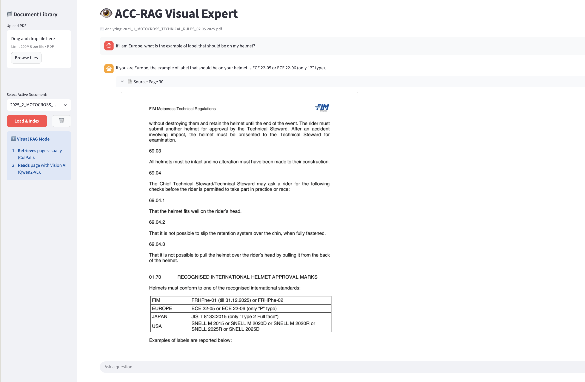
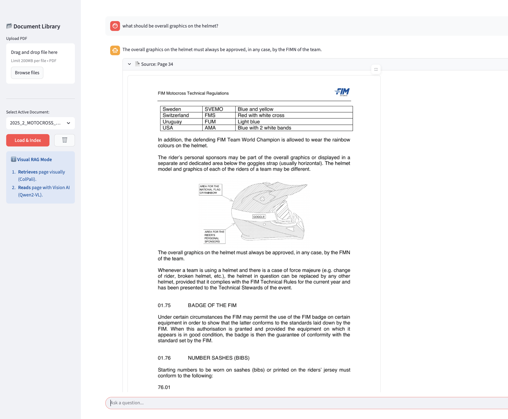

# ACC-RAG Visual Expert 👁️

**ACC-RAG Visual Expert** is a Vision-RAG (Retrieval-Augmented Generation) application built to help users interact with complex PDF documents. Instead of relying only on text extraction, it uses visual retrieval so the system can understand charts, tables, and layouts as they appear on the page.

## Overview

Traditional RAG pipelines often depend on OCR and plain text extraction, which can miss layout and visual context. ColPali is designed for document retrieval from visual page features, while Qwen2-VL can analyze retrieved page content as a vision-language model. 

This project combines those ideas in a Streamlit interface so users can upload a PDF, index its pages visually, and ask questions grounded in the most relevant page. 

## Features

- **Visual retrieval with ColPali**: Indexes PDF pages as visual representations instead of depending only on extracted text. [web:5]
- **Vision-based answer generation with Qwen2-VL**: Analyzes the retrieved page, including tables, diagrams, and layout-aware content. [web:12]
- **Interactive Streamlit UI**: Provides a simple app interface for document upload, indexing, querying, and source preview. 
- **Better handling of visually rich PDFs**: Useful for reports, scanned documents, charts, and presentation-style PDFs where layout matters. 

## Installation

Clone the repository and install the required dependencies:

```bash
git clone https://github.com/pranjalparmar/ColPali-Vision-RAG.git
pip install -r requirements.txt
```

## Usage

Start the Streamlit app with:

```bash
streamlit run main.py
```

`streamlit run` is the standard command Streamlit uses to launch an app from a Python script. [web:7]

Then follow these steps:

1. Upload a PDF in the **Document Library**.
2. Click **Load & Index** to generate visual embeddings.
3. Ask a question in the chat input.
4. Review the retrieved source page shown by the app.

## Screenshots

### Sidebar & Document Indexing


### Visual Query & Response



## Tech Stack

- **Frontend**: [Streamlit](https://streamlit.io/)
- **Visual Retriever**: [ColPali](https://huggingface.co/vidore/colpali-v1.2)
- **Vision-Language Model**: [Qwen2-VL-7B-Instruct](https://huggingface.co/Qwen/Qwen2-VL-7B-Instruct)
- **Language**: Python 

